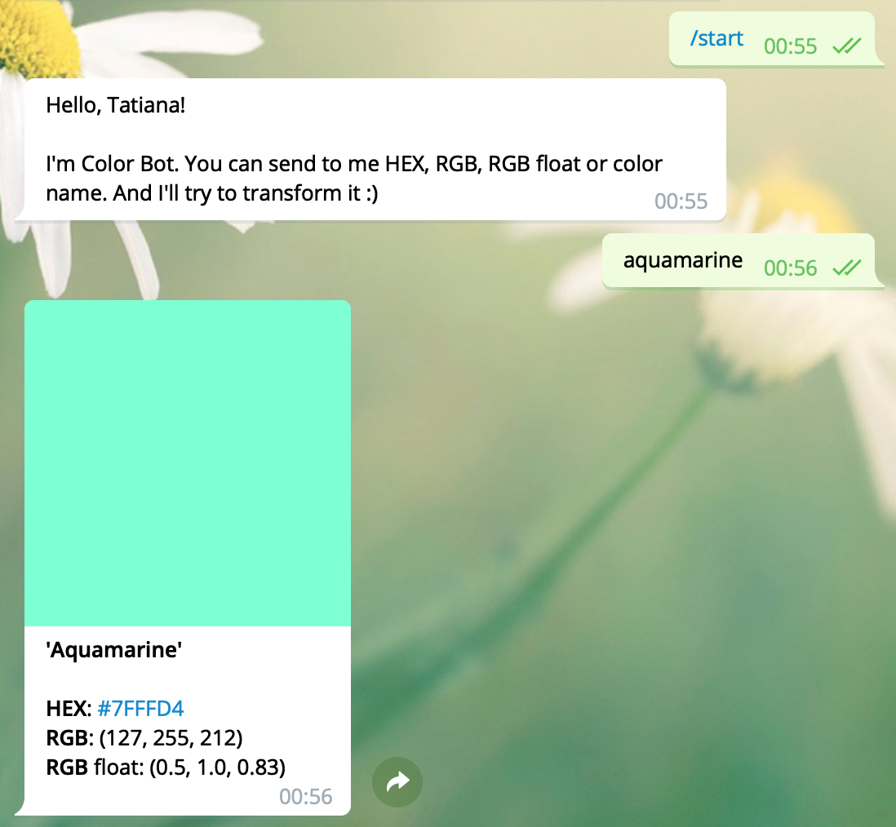

Color Bot
======

Color Bot is Telegram bot.
It can convert color in different encodings like HEX, RGB and RGB float.
Just send a color or color name, and you will get its encodings and color image.
Supported formats: 
- FFFFFF
- \#FFFFFF
- 255 255 255
- 0.1, 0.1, 0.1
- RGB(255, 255, 255)
- RGB(1.0, 1.0, 1.0)

or you can just send a name of color. For example: Green, Orange or even Aquamarine. 
Register, spaces and separators don't matter.

Telegram username: @color_palette_bot

